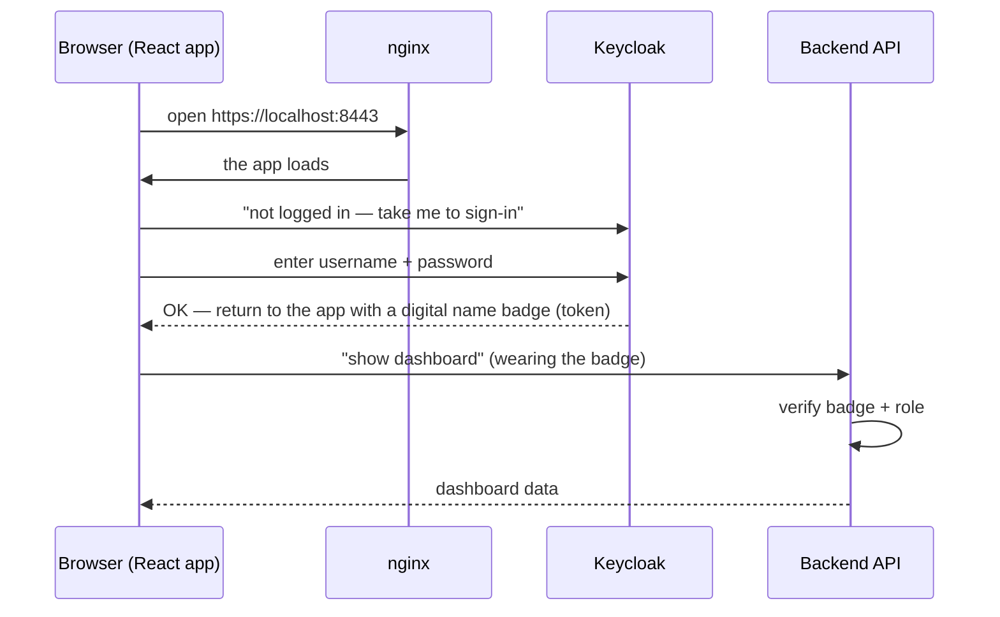

# How the Versa CPE Credential Manager works

A plain-language walkthrough of the solution, written for operations staff and
anyone new to the system.

## Big picture

The system is a **web app with a front door, a login office, a brain, and two
cupboards for data**.

```
Browser ──► nginx (front door, https://localhost:8443)
                │
                ├──► React app (the screens you see)
                ├──► Backend API (the brain — rules + logic)
                └──► Keycloak (login + roles: admin / ops / field)
                       Brain ──► PostgreSQL (records: CPEs, users, audit trail)
                       Brain ──► Secret store (passwords kept separate)
                       Brain ──► Redis (coordinates background jobs)
```

| Piece        | What it is            | Job                                                                 |
| ------------ | --------------------- | ------------------------------------------------------------------- |
| **nginx**    | Front door / TLS      | Serves the web app, rate-limits login attempts, routes traffic       |
| **React app**| The browser UI        | Dashboard, CPE inventory, audit log, admin screens                   |
| **Keycloak** | Identity office       | Logs people in, stamps their role (admin / ops / field)              |
| **Backend API** | The brain          | Checks who you are, enforces rules, logs everything                  |
| **PostgreSQL** | The records cupboard | CPEs, users, assignments, audit log, secret *references*             |
| **Secret store** | The safe           | Stores the **actual passwords** separately from the database (mock vault in lab, Vault in production) |
| **Redis**    | Quick note-pad        | Helps background jobs (like rotations) run one at a time             |

## Logging in (single sign-on)



Your role is on the badge, so the app only shows screens you're allowed to use
(field users never see admin pages).

## Everyday use

- **Browse CPE inventory** — the app asks the API for the list; the API checks
  your badge and pulls records from PostgreSQL.
- **Reveal a password** — the API checks you're *assigned* to that CPE (or
  allowed by role), records *who/what/when/why* in the **Audit Log**, then opens
  the safe and shows the secret briefly.
- **Rotate credentials** — ops clicks rotate; the API runs the rotation job
  (talking to the Director API — a **mock** in this test lab), puts the new
  password in the safe, updates the record, and logs the rotation.
- **Admin pages** — manage Directors, Assignments, Users, password policy, and
  the read-only Integrations status page.

## The audit trail

Every sensitive action (viewing a password, rotating, failed login) writes an
entry: **who did it, what they did, did it succeed, from where, and a
correlation ID**. The Audit Log is the full, traceable history — the key feature
for compliance and incident response.

## What is mocked in this lab (know what you are testing)

- **Director API** (the real CPE gear) → mock client; real rotation is wired in
  a later phase.
- **Secret store** → in-memory mock vault (passwords reset when containers are
  recreated).
- **LDAP/AD federation** → disabled for now; logins come from Keycloak's own
  demo users.

Each of these is called out on the **Integrations** page so the lab report stays
honest about scope.